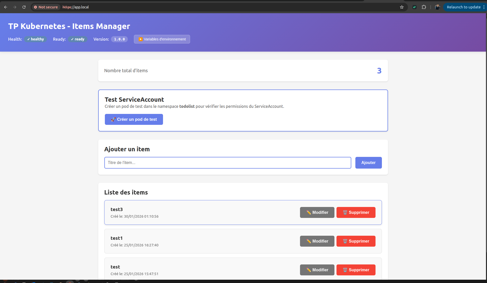
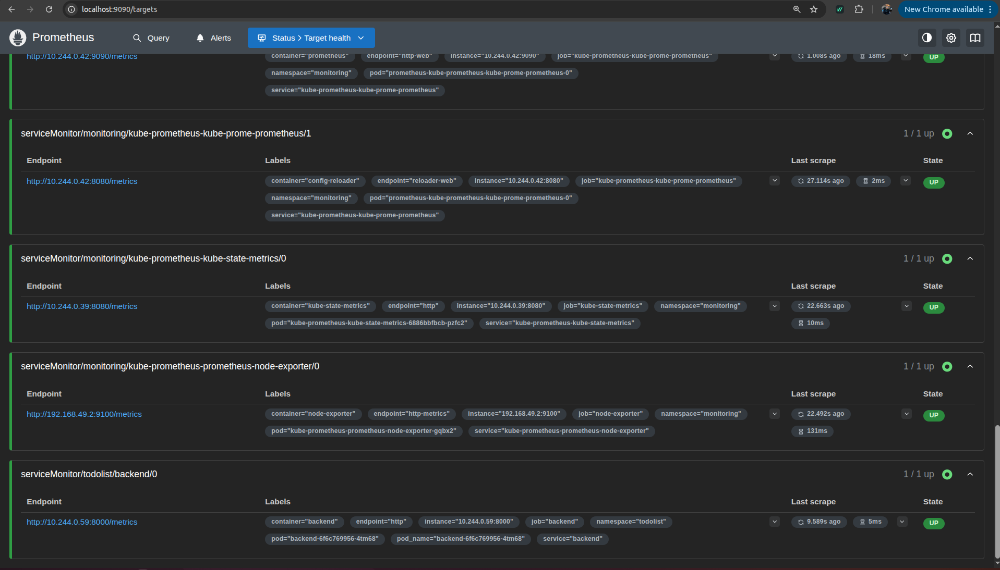
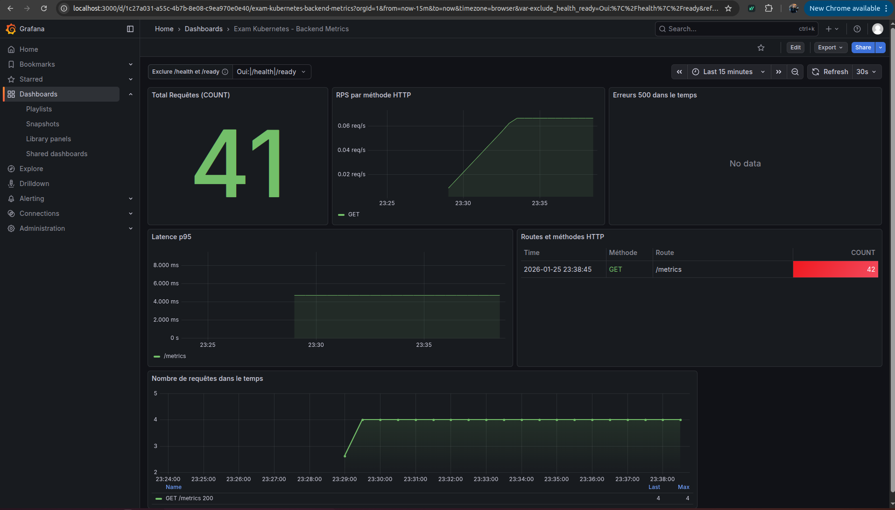
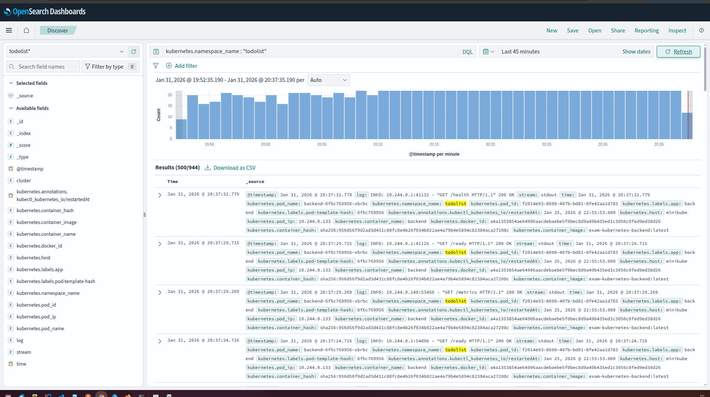

# Examen Kubernetes — Application Todolist (DevSecOps / SRE)

Ce projet déploie une application complète **Frontend / Backend / PostgreSQL** sur Kubernetes avec une approche **DevSecOps** et **SRE** :

- 🔐 HTTPS automatique avec **cert-manager + Ingress**
- 📊 Monitoring avec **Prometheus + Grafana**
- 📝 Centralisation des logs avec **OpenSearch + Fluent Bit**
- 🔑 Secrets dynamiques avec **HashiCorp Vault**
- 📦 Manifests Kubernetes déclaratifs

---


## 🚀 Ordre de déploiement

### Namespaces

```bash
kubectl apply -f manifests/namespaces.yaml
```

### Base de données

```bash
kubectl apply -f manifests/database/
```

### Backend & Frontend

```bash
kubectl apply -f manifests/backend/
kubectl apply -f manifests/frontend/
```

---

## 🔐 Application fonctionnelle en HTTPS

L’application est exposée via un **Ingress NGINX** et un certificat TLS généré automatiquement par **cert-manager**.

Accès :

```
https://app.localhost
```



---

## 📊 Monitoring opérationnel (Prometheus + Grafana)

Les métriques du backend sont scrapées via un **ServiceMonitor** (CRD Prometheus Operator).

### Prometheus — Targets backend UP



### Grafana — Dashboard Backend

Le dashboard Grafana a été exporté en JSON et est disponible dans :

```
resources/grafana-dashboard-backend-metrics.json
```



---

## 📝 Centralisation des logs (OpenSearch + Fluent Bit)

Les logs du :

- Backend (Uvicorn / FastAPI)
- Frontend (Nginx / React)

sont collectés par **Fluent Bit** (DaemonSet) puis envoyés vers **OpenSearch**.

Visualisation via OpenSearch Dashboards → Discover avec l’index pattern :

```
todolist*
```



---

## 🔑 Vault — Credentials dynamiques PostgreSQL 

Vault génère des credentials PostgreSQL temporaires avec TTL via le **Database Secrets Engine**.

Authentification automatique des pods via **ServiceAccount Kubernetes** (sans token statique).

---

## 🧠 Architecture mise en place

| Namespace | Rôle |
|-----------|------|
| db | PostgreSQL (stateful) |
| todolist | Backend / Frontend |
| monitoring | Prometheus / Grafana |
| logging | OpenSearch / Fluent Bit |
| vault | Secrets dynamiques |

---

---

## 📦 Dashboard Grafana exporté

```
resources/grafana-dashboard-backend-metrics.json
```

---

## 🎯 Résultat final

Une architecture Kubernetes complète intégrant :

- Sécurité (TLS + Vault)
- Observabilité (metrics + logs)
- Manifests reproductibles
- Isolation par namespaces
- Bonnes pratiques cloud-native (12-factor, RBAC, probes, resources)
